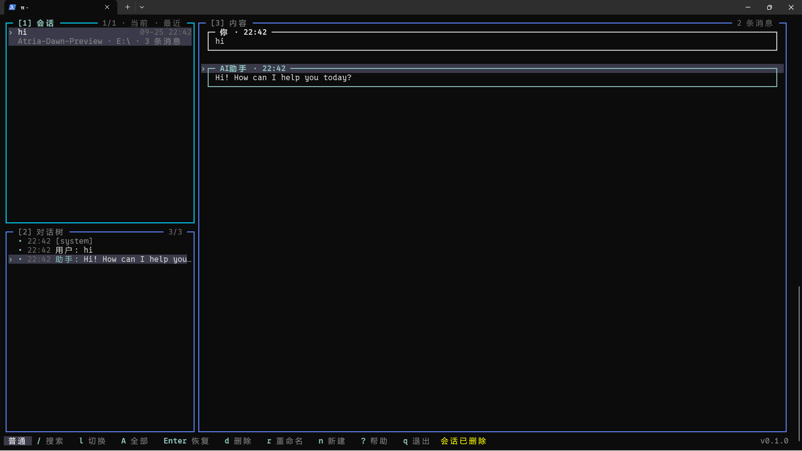

[English](./README.md) | **中文**

## 简介

pi-lazy-panel 是 [pi](https://pi.dev) 会话和会话树管理的面板，提供类似于 lazygit 的操作方式和 TUI 风格。安装后在 pi 中执行 `/lazy-panel`，即可打开一个占满终端的三面板界面：

- 左上 **SESSIONS**：历史会话列表（对应 `/resume`）
- 左下 **TREE**：当前所选会话的对话树（对应 `/tree`，随上方选择自动切换）
- 右侧 **CONTENT**：所选节点的对话详情，用 pi 原生 Markdown 渲染，区分「我」和「AI」

围绕会话的常用操作（新建 / 恢复 / 分叉 / 克隆 / 改名 / 删除 / 压缩 / 导出 / 导入 / 分享 / 复制）都收敛成单键快捷键，全程无需鼠标。

## 界面预览



## 特点

1. 纯粹的键盘流，大部分的操作使用一个键就能完成（hjkl 移动、d 删除、r 改名，参考 lazygit）
2. 三面板联动：SESSIONS → TREE → CONTENT 随光标自动级联刷新
3. 覆盖全套会话命令：resume / new / fork / clone / rename / delete / compact / export / import / share / copy
4. 会话树导航：可恢复到任意节点，并选择「不摘要 / 摘要 / 自定义摘要」处理被放弃的分支
5. lazygit 风格搜索：`/` 就地跳转、`n` / `N` 循环，支持 `name:` `model:` `path:` `tag:` `role:` `after:` `before:` 限定词
6. 主题跟随 pi 自动切换
7. 支持中英文（跟随系统语言，可在配置里覆盖）
8. 快捷键完全可自定义：在 `~/.pi/agent/lazy-panel.json` 里重绑任意动作
9. 鼠标轻量适配（滚轮滚动、单击聚焦、双击进入 / 折叠）

## 快速开始

需要已安装 [pi](https://pi.dev)，在 pi 中执行安装命令：

```bash
# npm
pi install npm:pi-lazy-panel

# GitHub
pi install git:github.com/JessieChan0730/pi-lazy-panel
```

安装后在 pi 里执行 `/lazy-panel` 打开面板，`?` 可查看当前面板的全部快捷键。

## 本地开发

pi 相关的包是 `devDependencies`，克隆后必须先安装依赖：

```bash
npm install            # 安装依赖（含 pi 相关包，默认不会自动装）
npm run dev            # 用 pi -e ./src/index.ts 临时加载插件，不写配置
npm run install:pi     # pi install . 把本目录注册进 pi，只需一次；改完代码在 pi 里 /reload 即最新
```

提交前请跑全部检查（与 pre-push 钩子一致）：

```bash
npm run lint           # ESLint
npm run check          # tsc --noEmit
npm test               # 单元测试
npm run i18n:check     # 中英文案对齐
```

## 兼容性

- **运行环境**：Node.js ≥ 20。
- **pi 版本**：作为 pi 插件运行，依赖 pi 的会话 API（`@earendil-works/pi-coding-agent`）。
- **运行模式**：仅在 pi 的 TUI 模式下可用（非 TUI 模式下 `/lazy-panel` 会拒绝打开）。
- **操作系统**：跨平台，Windows / macOS / Linux 均可（路径按平台统一处理）。
- **终端**：regular 模式下的鼠标支持需要终端支持 SGR 鼠标上报（现代终端基本都支持）；不支持也不影响键盘操作。
- **可选外部命令**：`/share` 需要已登录的 GitHub CLI（`gh`）；删除会话时若存在 `trash` 则移入回收站，否则直接删除。

## 配置文件

配置文件位于 `~/.pi/agent/lazy-panel.json`，所有字段均为可选，缺省时使用内置默认值：

```json
{
 "locale": "zh",
 "defaultScope": "all",
 "defaultSort": "recent",
 "leftColumnRatio": 0.25,
 "keymap": {
  "global": { "help": "F1", "scope-all": ["A", "ctrl+space"] },
  "sessions": { "session-delete": "ctrl+d", "session-share": null }
 }
}
```

| 字段              | 说明             | 可选值 / 范围                                       | 默认               |
| ----------------- | ---------------- | --------------------------------------------------- | ------------------ |
| `locale`          | UI 语言          | `"en"` / `"zh"`                                     | 跟随系统语言       |
| `defaultScope`    | 打开时的会话范围 | `"current-folder"` / `"all"`                        | `"current-folder"` |
| `defaultSort`     | 会话列表排序     | `"recent"` / `"created"` / `"title"` / `"threaded"` | `"recent"`         |
| `leftColumnRatio` | 左侧列宽占比     | `0.15` ~ `0.6`                                      | `0.25`             |
| `keymap`          | 自定义快捷键     | 见下                                                | 内置键位           |

`keymap` 按 `scope`（`global` / `sessions` / `tree` / `content` / `tree-dialog`）分组，键为动作 id、值为一个或多个 chord（如 `"ctrl+d"`、`["A", "ctrl+space"]`）；用户提供的键位**整体替换**该动作的默认值，`null` 表示解绑。完整的动作 id 与键位说明见 [docs/keybindings.zh.md](./docs/keybindings.zh.md)。

## 下一步计划

- 添加设置面板
- 添加多主题 / 自定义主题

## 贡献

欢迎贡献代码——本地环境、代码规范与提交 / PR 流程见 [CONTRIBUTING.zh.md](./CONTRIBUTING.zh.md)。

## License

基于 [MIT 许可证](./LICENSE)授权。
